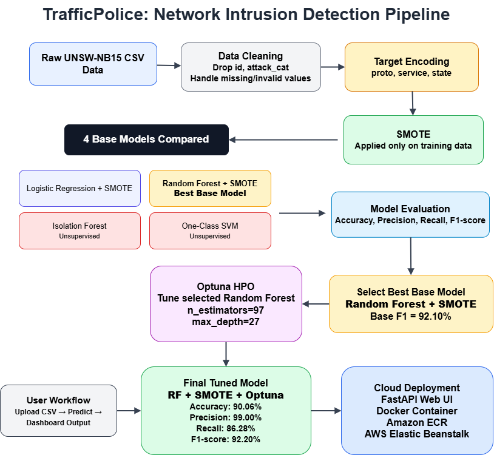
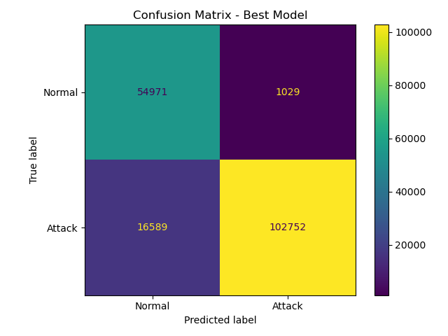

# TrafficPolice: ML-Based Network Intrusion Detection System

TrafficPolice is a machine learning based **Network Intrusion Detection System** that classifies network traffic as **Normal** or **Attack** using the UNSW-NB15 dataset.

The project covers the complete machine learning workflow, including data preprocessing, supervised and unsupervised model comparison, hyperparameter optimization using Optuna, model evaluation, FastAPI dashboard development, Docker containerization, and AWS deployment.

---

## Project Infographic


---

## Problem Statement

Network intrusion detection is important for identifying malicious traffic and protecting systems from cyber attacks. Traditional rule-based systems may fail when attack patterns change, so machine learning can help by learning patterns from network traffic data.

The goal of this project is to build a system that can:

* Analyze network traffic records
* Classify each record as **Normal** or **Attack**
* Compare multiple machine learning models
* Select and tune the best-performing model
* Deploy the final system through a working web dashboard

---

## Dataset

The project uses the **UNSW-NB15** dataset, a benchmark dataset for network intrusion detection.

### Dataset Details

| Item             |   Value |
| ---------------- | ------: |
| Training Records |  82,332 |
| Testing Records  | 175,341 |
| Features Used    |      42 |
| Target Column    | `label` |
| Normal Label     |     `0` |
| Attack Label     |     `1` |

### Example Features

Some important dataset features include:

* `proto` — network protocol
* `service` — network service
* `state` — connection state
* `dur` — duration
* `sbytes` — source bytes
* `dbytes` — destination bytes
* `rate` — packet rate
* `spkts` — source packets
* `dpkts` — destination packets

The columns `id` and `attack_cat` were removed before training.
`id` is only a row identifier, while `attack_cat` can cause leakage because it directly provides attack-type information.

---

## Project Pipeline

The system follows this complete machine learning pipeline:

```text
Raw UNSW-NB15 Data
        ↓
Data Cleaning
        ↓
Remove id and attack_cat
        ↓
Target Encoding for proto, service, state
        ↓
SMOTE for class balancing
        ↓
Train 4 Base Models
        ↓
Compare Models using F1-score
        ↓
Select Random Forest + SMOTE
        ↓
Apply Optuna Hyperparameter Optimization
        ↓
Evaluate Final Tuned Model
        ↓
Deploy using FastAPI, Docker, ECR, and Elastic Beanstalk
```



---

## Preprocessing

The preprocessing stage includes:

* Loading training and testing CSV files
* Removing unnecessary columns
* Splitting features and labels
* Encoding categorical columns
* Applying SMOTE only on training data

### Target Encoding

The categorical columns:

```text
proto
service
state
```

were converted into numerical values using a custom `TargetEncoder`.

Target encoding replaces each category with a value based on the attack rate learned from the training data. Smoothing was used to avoid overfitting on rare categories.

### SMOTE

SMOTE was applied only on the training data to reduce class imbalance.

This is important because applying SMOTE on test data would create data leakage and make evaluation unfair.

---

## Models Trained

Four base models were trained and compared.

### Supervised Models

| Model                       | Purpose                          |
| --------------------------- | -------------------------------- |
| Logistic Regression + SMOTE | Simple baseline supervised model |
| Random Forest + SMOTE       | Main supervised tree-based model |

### Unsupervised Models

| Model            | Purpose                                |
| ---------------- | -------------------------------------- |
| Isolation Forest | Anomaly detection model                |
| One-Class SVM    | Boundary-based anomaly detection model |

The unsupervised models were trained mainly on normal traffic so they could learn normal behavior and identify unusual records as anomalies.

---

## Model Selection

The four base models were compared using:

* Accuracy
* Precision
* Recall
* F1-score

F1-score was used as the main selection metric because intrusion detection requires a balance between:

* catching attacks correctly
* avoiding too many false alarms

Random Forest + SMOTE achieved the best base F1-score, so it was selected for hyperparameter tuning.

---

## Hyperparameter Optimization with Optuna

After selecting Random Forest + SMOTE as the best base model, Optuna was used for hyperparameter optimization.

Optuna tuned the following Random Forest parameters:

```text
n_estimators
max_depth
min_samples_split
min_samples_leaf
```

### Best Parameters

```text
n_estimators = 97
max_depth = 27
min_samples_split = 9
min_samples_leaf = 1
```

Optuna was applied after model selection. It was not treated as a separate original base model.

---

## Final Results

| Model                          | Accuracy | Precision | Recall | F1-Score |
| ------------------------------ | -------: | --------: | -----: | -------: |
| Logistic Regression + SMOTE    |   85.69% |    97.89% | 80.71% |   88.47% |
| Random Forest + SMOTE          |   89.95% |    99.01% | 86.10% |   92.10% |
| Isolation Forest               |   64.90% |    80.78% | 63.56% |   71.14% |
| One-Class SVM                  |   65.87% |    81.82% | 64.09% |   71.88% |
| Random Forest + SMOTE + Optuna |   90.06% |    99.00% | 86.28% |   92.20% |

### Final Selected Model

```text
Random Forest + SMOTE + Optuna
```

Final tuned model performance:

| Metric    |  Score |
| --------- | -----: |
| Accuracy  | 90.06% |
| Precision | 99.00% |
| Recall    | 86.28% |
| F1-score  | 92.20% |

---

## Confusion Matrix



The confusion matrix shows strong attack detection and low false positives, although some attacks are still missed.

| True / Predicted | Normal |  Attack |
| ---------------- | -----: | ------: |
| Normal           | 54,971 |   1,029 |
| Attack           | 16,589 | 102,752 |

---

## Web Application

The project includes a FastAPI based web dashboard.

The dashboard allows users to:

* Upload a CSV file
* View normal and attack prediction counts
* See row-wise predictions
* Compare Random Forest and Isolation Forest outputs
* View attack probability and confidence scores

### Application Flow

```text
User Uploads CSV
        ↓
FastAPI Backend Reads File
        ↓
Model Pipeline Preprocesses Input
        ↓
Random Forest Predicts Normal / Attack
        ↓
Dashboard Displays Results
```

Add your dashboard screenshot here if available:


---

## Deployment

The application was deployed using Docker and AWS services.

### Deployment Stack

| Tool                  | Purpose                    |
| --------------------- | -------------------------- |
| FastAPI               | Backend API and web server |
| Jinja2 / HTML         | Web dashboard              |
| Docker                | Containerization           |
| Amazon ECR            | Docker image storage       |
| AWS Elastic Beanstalk | Cloud deployment           |

### Deployment Flow

```text
Local Project
        ↓
Docker Image
        ↓
Amazon ECR
        ↓
AWS Elastic Beanstalk
        ↓
Public Web Application
```

Add deployment screenshot here if available:


---

## Project Structure

```text
TrafficPolice-ML-Intrusion-Detection/
│
├── app/
│   ├── app.py
│   └── templates/
│       └── index.html
│
├── assets/
│   ├── trafficpolice_infographic.png
│   ├── pipeline.png
│   ├── confusion_matrix_best_model.png
│   ├── dashboard.png
│   └── deployment.png
│
├── docs/
│   └── TrafficPolice_Report.pdf
│
├── models/
│   ├── best_model.pkl
│   ├── logistic_pipeline.pkl
│   ├── random_forest_pipeline.pkl
│   ├── isolation_forest_pipeline.pkl
│   ├── oneclass_svm_pipeline.pkl
│   └── random_forest_optuna_pipeline.pkl
│
├── results/
│   ├── supervised_results.csv
│   ├── unsupervised_results.csv
│   ├── optuna_results.csv
│   ├── final_model_comparison.csv
│   ├── accuracy_comparison.png
│   ├── precision_comparison.png
│   ├── recall_comparison.png
│   ├── f1_score_comparison.png
│   └── confusion_matrix_best_model.png
│
├── preprocess.py
├── train_supervised.py
├── train_unsupervised.py
├── optuna_tuning.py
├── evaluate.py
├── requirements.txt
├── Dockerfile
├── Dockerrun.aws.json
├── README.md
└── .gitignore
```

---

## How to Run Locally

### 1. Clone the repository

```bash
git clone https://github.com/YOUR_USERNAME/TrafficPolice-ML-intrusion-detection-project.git
cd TrafficPolice-ML-intrusion-detection-project
```

### 2. Install dependencies

```bash
pip install -r requirements.txt
```

### 3. Run the FastAPI application

```bash
uvicorn app.app:app --reload
```

Open the app in your browser:

```text
http://127.0.0.1:8000
```

---

## Run with Docker

### Build Docker image

```bash
docker build -t trafficpolice .
```

### Run Docker container

```bash
docker run -p 8000:8000 trafficpolice
```

Then open:

```text
http://127.0.0.1:8000
```

---

## Main Python Files

| File                    | Purpose                                                            |
| ----------------------- | ------------------------------------------------------------------ |
| `preprocess.py`         | Loads data, splits features/labels, and defines TargetEncoder      |
| `train_supervised.py`   | Trains Logistic Regression and Random Forest supervised models     |
| `train_unsupervised.py` | Trains Isolation Forest and One-Class SVM anomaly detection models |
| `optuna_tuning.py`      | Performs Optuna hyperparameter tuning for Random Forest            |
| `evaluate.py`           | Generates final comparison results, graphs, and confusion matrix   |
| `app/app.py`            | FastAPI backend for CSV upload and prediction dashboard            |

---

## Report

A compact IEEE-style project report is available here:

[TrafficPolice Report](docs/TrafficPolice_Report.pdf)

---

## Tech Stack

* Python
* Pandas
* Scikit-learn
* Imbalanced-learn
* Optuna
* Joblib
* Matplotlib
* FastAPI
* Jinja2
* Docker
* Amazon ECR
* AWS Elastic Beanstalk

---

## Key Learnings

This project helped strengthen understanding of:

* Network intrusion detection datasets
* ML preprocessing and leakage prevention
* Target encoding for categorical features
* Class balancing using SMOTE
* Supervised vs unsupervised model comparison
* Hyperparameter optimization using Optuna
* Model serialization using Joblib
* FastAPI web deployment
* Docker-based containerization
* AWS cloud deployment using ECR and Elastic Beanstalk

---

## Future Improvements

Possible future improvements include:

* Multi-class attack classification using `attack_cat`
* Real-time packet capture integration
* MLflow-based experiment tracking
* More advanced models such as XGBoost or LightGBM
* Better frontend dashboard analytics
* Authentication for uploaded traffic files

---

## Authors

* Huzaifa Amir
* Mariam Atta

---

## Disclaimer

This project is developed for educational purposes. The model is trained on the UNSW-NB15 dataset and should not be directly used as a production security system without further validation, monitoring, and security testing.
